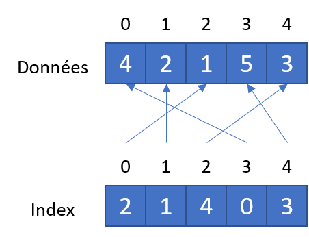

# Exercice 7

Cet exercice fait suite à l'exercice 6. Il faut complèter le programme en ajoutant un option permettant de trier le vecteur de chaîne de caractère.

Le vecteur n'est pas physiquement trié. Il faut créer un index trié sur le vecteur.

## Qu'est-ce qu'un index ?

Un index est une structure de donnée (ici un vecteur) servant à localiser des données selon un ordre déterminer par un ensemble de données grâce à une référence vers la donnée (ici un indice ou une adresse).

Dans notre situation, nous avons 2 vecteurs, le vecteur des données (le vecteur de chaînes de caractères) et l'index. Le vecteur des données n'est pas trié. L'index ne contient pas de données (il pourrait en contenir) mais une référence vers les données. L'index lui est trié selon la clé de tri choisie.

Le schéma ci-dessous représente un vecteur de données et un vecteur d'index (le vecteur d'index contient les valeurs des indices du vecteur de donnéees)

